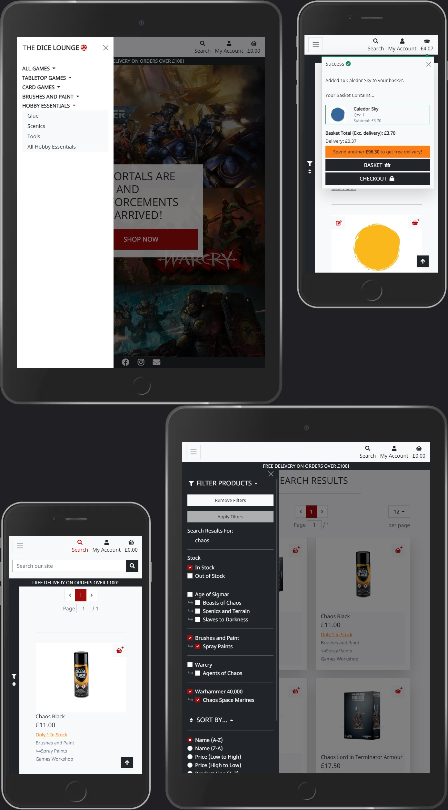
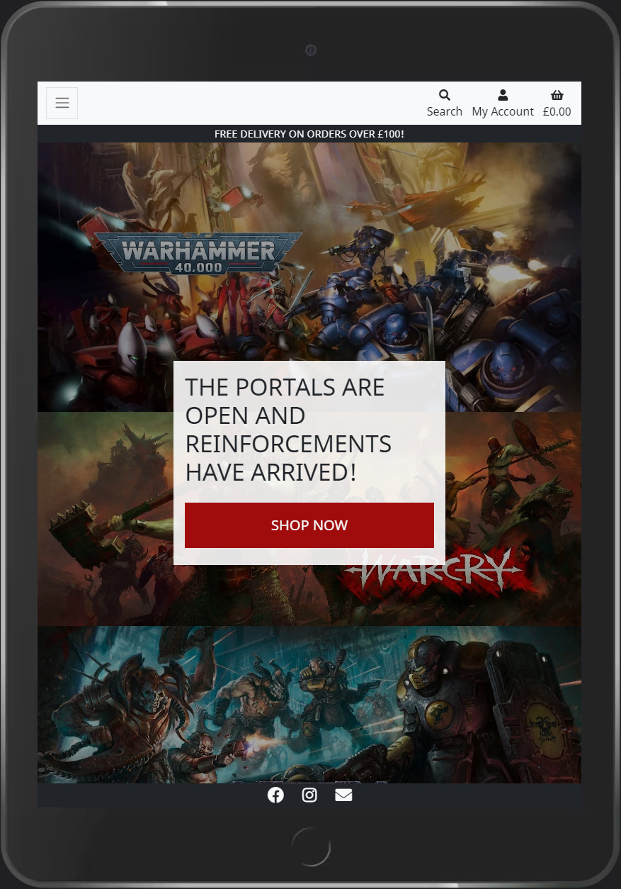
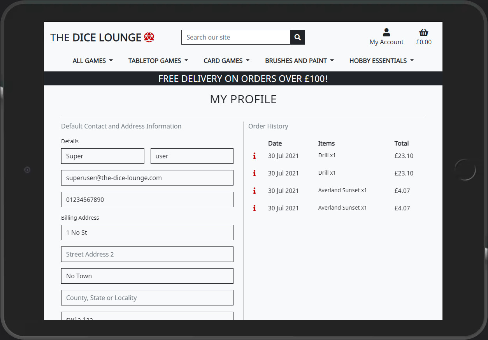
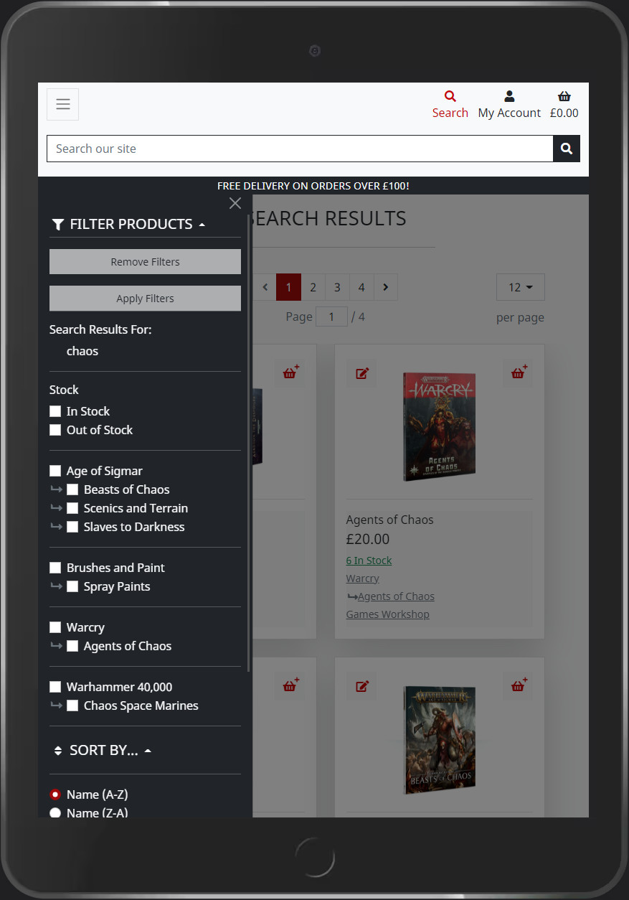
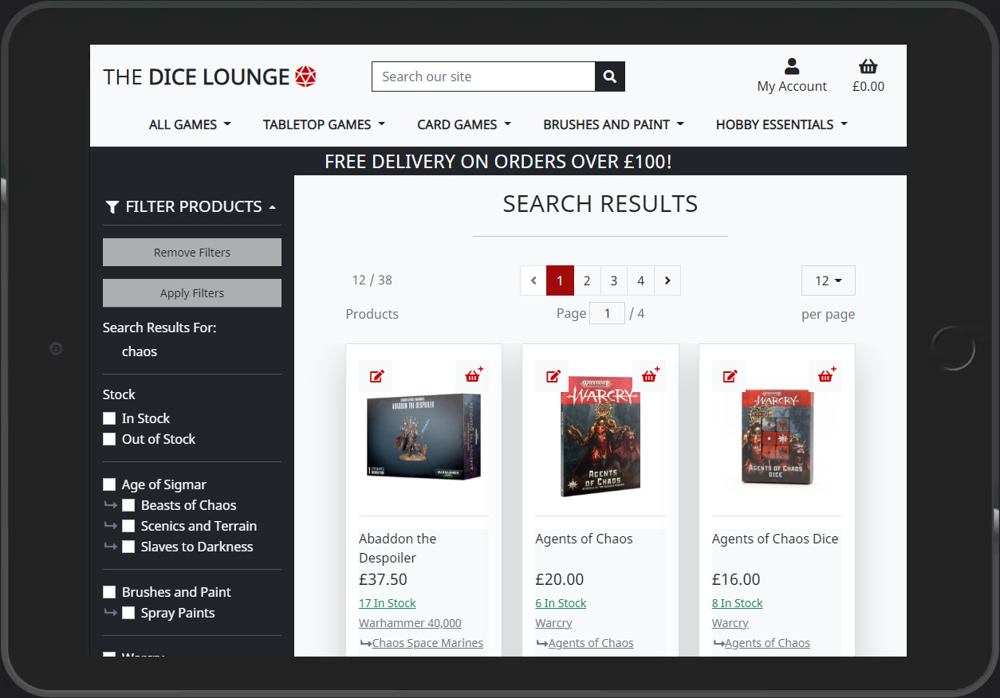

# The Dice Lounge

### Full Stack Frameworks with Django Milestone Project



The Dice Lounge is an FLGS (Friendly Local Gaming Store) situated in the Shire.  They are a small family business selling board/collectible gaming products.  The website provides a smart, clean, intuitive experience for customers within the UK.  Shoppers can easily view/search available products, are presented with a plethora of options to filter results, and can easily and quickly make a purchase.  If a customer chooses to create an account, they are able to view their entire order history and save contact/address information to enhance future order experiences.

Customers are able to visit the physical store location where there is space to meet with friends and play games, and a booking option is available through the website.

### View the live site [here](https://the-dice-lounge.herokuapp.com/).

---
# Table of Contents
- [UX](#ux)
	- [Website Owner Goals](#website-owner-goals)
	- [User Goals](#user-goals)
		- [New User Goals](#new-user-goals)
		- [Returning User Goals](#returning-user-goals)
	- [User Stories](#user-stories)
		- [As a Store Owner](#as-a-store-owner-i-want-to-be-able-to)
		- [As a Shopper](#as-a-shopper-i-want-to-be-able-to)
		- [As a Returning User](#as-a-returning-user-i-want-to-be-able-to)
		- [As a Physical Store Visitor](#as-a-physical-store-visitor-i-want-to-be-able-to)
	- [Wireframes](#wireframes)
		- [Differences between the Wireframes and final design](#differences-between-the-wireframes-and-final-design)
	- [Surface](#surface)
		- [Colours](#colours)
		- [Fonts](#fonts)
		- [Images](#images)
- [Features](#features)
	- [Desired Features based on User Stories](#desired-features-based-on-user-stories)
	- [Existing Features](#existing-features)
	- [Features Left to Implement](#features-left-to-implement)
	- [Outstanding Issues](#outstanding-issues)
- [Technologies Used](#technologies-used)
- [Testing](#testing)
- [Notable Challenges](#notable-challenges)
- [Database Diagram](#database-diagram)
- [Deployment](#deployment)
	- [Pre-deployment](#pre-deployment)
	- [Amazon S3](#amazon-s3)
	- [GMail](#gmail)
	- [GitHub Repository](#github-repository)
	- [Site Deployment](#site-deployment)
		- [Heroku](#heroku)
		- [Migrations and Fixtures](#migrations-and-fixtures)
		- [Local Deployment](#local-deployment)
	- [Post Deployment](#post-deployment)
- [Credits](#credits)
	- [Content](#content)
	- [Acknowledgements](#acknowledgements)
	- [Research](#research)
- [Screenshots](#screenshots)
___
# UX
The Dice Lounge is a website for a friendly local gaming store.  It is simple and intuitive to use, allowing easy access to the product line with an intuitive UX including search capabilities.  Registered users can store contact/address information, and view their entire order history.

The Dice Lounge has a clean, sharp design built using Bootstrap 5.  The site is functional on desktops, laptops and mobile devices, with a minimum supported width of 280px.

*NB: The site will function at lower resolutions, but the page will scroll as required.*

## Website Owner Goals
The owners of The Dice Lounge manage a Friendly Local Gaming Store in the heart of the Shire.  The physical store location is a place for people to chat and play games as well as make purchases.  They want to expand their presence online to assist with growing the business, with a longer term view of opening additional venues.

The site needed to be functional on desktop, laptop and mobile devices.  Users must be able to create an account to track their order history and store address/contact information if they choose to do so - it must not be a requirement.  If possible, users should be able to book an in store game session via the site.

## User Goals

#### New User Goals:
1. User is able to search for and purchase products without requiring an account.
2. User can create an account to store order history, address and contact information.
3. User can book a table to play games at the store.

#### Returning User Goals:
1. User can review any previously completed orders to determine the quantity and cost of each purchased item, total order cost and delivery information.
2. User can view/update the contact information stored on their profile

## User Stories

#### As a Store Owner I want to be able to:
1. Add a product to add new items to my store
2. Edit/update a product to change product prices, descriptions, images and other product criteria
3. Remove items from sale
4. Mark items as reduced to apply a percentage based price reduction and show a reason such as 'on sale' or 'clearance'

#### As a Shopper I want to be able to:
1. View a list of products so that I can select some to purchase
2. View individual product details so that I can identify the price, description and product image
3. Quickly identify deals, clearance items and special offers to take advantage of special savings on products I'd like to purchase
4. Easily view the total of my purchases at any time to avoid spending too much
5. Sort the list of available products to easily identify the best priced and categorically sorted products
6. Sort a specific category of product to find the best priced item in a specific category, or sort products in that category by name
7. Sort multiple categories of products simultaneously to find the best priced item in broad categories such as 'tabletop games'
8. Search for a product by name or description to find a specific product I'd like to purchase.
9. Easily see what I've searched for and the number of results to quickly decide whether the product I want is available
10. Easily select the quantity of a product when purchasing it to ensure I don't accidentally select the wrong product and/or quantity
11. View items in my bag to be purchased to identify the total cost of my purchase and all items I will receive
12. Adjust the quantity of individual items in my bag so that I easily make changes to my purchases before checkout
13. Easily enter my payment information to checkout quickly with no hassle
14. Feel my personal and payment information is safe and secure to confidently provide the needed information to make a purchase
15. View an order confirmation after checkout to verify that I haven't made any mistakes
16. Receive an email confirmation after checking out to keep the confirmation of my purchase or my records

#### As a Returning User I want to be able to:
1. Easily register for an account so that I can have a personal account and be able to view my profile
2. Easily log in or out to access my personal account information
3. Easily recover my password in case I forget it so that I can recover access to my account
4. Receive an email confirmation after registering to verify that my registration was successful

#### As a physical store visitor I want to be able to:
1. Easily book a table so that I can meet up and play with an opponent
2. Receive an email confirmation after booking to verify that my booking was successful

## Wireframes

Wireframes created in [Balsamiq](https://balsamiq.com/wireframes/), and exported to [/wireframes/dicelounge-wireframes.pdf](wireframes/dice_lounge_wireframes.pdf)

### Differences between the Wireframes and final design

* Product Navigation dropdowns were moved inside the main nav on desktop.
* Product filter/sort option dropdowns were replaced with the sidebar/collapsible sidenav.
* Products are individually smaller on the page, resulting in better visibility
* Products are paginated to prevent overloading the user with too large a page.  The number of products shown per page is customisable and the choice is persistent.
* Additional management pages were added for multiple models (Category, Genre, Publisher, Reduced Reason and Stock State)
* Table booking pages cut from the initial design due to time constraints.

# Surface
## Colours
* Background:  #f8f9fa
* Fonts and links:  #212529
* Selected Highlight:  #a00b0b
* Hover Highlight:  #c60001
* Selected/Hover Text:  #f8f9fa

## Fonts
I used [Noto Sans](https://fonts.google.com/specimen/Noto+Sans)/[Noto Sans JP](https://fonts.google.com/specimen/Noto+Sans+JP) throughout the site.

## Images
 * Favicon created editing the Font Awesome [dice-d20](https://fontawesome.com/v5.15/icons/dice-d20?style=solid) icon in [GNU Image Manipulation Program (GIMP)](https://www.gimp.org/)
 * Social media icons served by [Font Awesome](https://fontawesome.com/)

[Back to Table of contents](#table-of-contents)
___
# Features
The server is a Django implementation hosted by [Heroku](https://www.heroku.com/).  The backend database is [Heroku Postgres](https://www.heroku.com/postgres).  Static files and media are hosted on [Amazon S3](https://aws.amazon.com/s3/).
The website consists of multiple pages built from using [Django Templates](https://docs.djangoproject.com/en/3.2/topics/templates/).  Pages execute regular GET/POST requests, along with AJAX calls when required, and manipulate the DOM using JavaScript in conjunction with jQuery.  Content is navigable via on screen options as well as collapsible navigation menus at lower resolutions.  The header also features a site title which can be clicked to visit the home page.  The site footer contains social media and contact links.

## Desired Features based on User Stories

1. Fully responsive design allows for a functional site on mobile, tablet, laptop and desktop, with a minimum width of 280px.
2. A search field is available at the top of very page to improve product navigation.
3. Users can signup from the Nav menu on every page to create an account and store their order history.
4. Users can navigate to a booking page, allowing them to check availability of tables and complete a booking.
5. Returning users may log in to their account, and view their order history from the Profile page.
6. Returning users may log in to their account and update their stored contact and address information from the Profile page.
7. Store Owners may access the Product Management page when logged in to add new Products
8. When logged in, Store Owners may click the 'Edit' button on any Product to directly edit the Product details, set it's availability, and add/remove price reductions.
9. Shoppers may perform a search or view products via the navigation menus to select some to purchase
10. Shoppers may click on any item to see a more detailed view in the Product Detail page
11. When searching for items, Shoppers can apply filters to the results, including filtering for products that are reduced in price.
12. Shoppers can see their basket total below the basket icon on the sticky navigation bar at the top of the page
13. Shoppers can sort Product Lists and Search Results by a number of criteria, including name and price.
14. Shoppers can apply multiple filters simultaneously to any given list of products along with a sort criteria.
15. Shoppers can enter a search term from the search input on any page, which will target multiple fields, including name, description, product line and sub product line.
16. When search results are returned, the search term and number of results are shown at the top of the page, above the list of products that were located.
17. Shoppers may add items to their basket from the Detail page for that product.  The page features a quantity input, allowing the user to select how many of the item they wish to add.
18. Shoppers may view the contents of their basket by clicking the basket icon at the top of any page.  The basket page shows the list of items in the basket (including a small image and some basic details), the quantity of that item, and the subtotal of those items.  Quantity controls are displayed to adjust the number of any given item.  A 'remove' link is also present should the Shopper wish to remove all instances of a Product from their basket.
19. The checkout features a simple form for entering required contact, billing and card information.
20. Card details are never stored.  Contact and Address information is secured behind an account system.  Secure Payment information is handled by Stripe.
21. Once an order is complete, the Shopper is redirected to an Order Confirmation page which displays an order summary featuring product, contact and delivery information.
22. When an order is completed, an email is sent to the Shopper at the email address they provided, containing an order summary.
23. Returning users may log in/out from the Account menu at the top of every page
24. Returning users may recover their password from the 'Forgot Password?' link on the login page
25. As part of the registration process, a user will receive an email containing a confirmation link.  Clicking this link will complete the registration process and advise the user that it was successful.
26. When completing a table booking, users will receive a booking confirmation via email.


## Existing Features

1. Fully responsive design allows for a functional site on mobile, tablet, laptop and desktop, with a minimum width 360px.
	>The site is responsive on all devices up to the minimum width.  Devices below the minimum width will work, with horizontal scrolling.

2. Search, Profile and Basket links, along with Product navigation links, are available on every page.
	>Product navigation is shifts to an off-canvas sidenav at mobile resolutions.

	>The search input is displayed by default on desktop resolutions, and in a collapsible on mobile to reduce the height of the nav on smaller devices.

3. Product Management is available to staff users
	>Staff users have access to the 'Product Management' link on their Account menu.

	>Staff users will see Edit links on all products and product lines on the 'All Games', 'Product', and 'Search Result' pages.

	>Product Lines, Sub Product Lines, Products, Categories, Genres, Publishers, Reduced Reasons and Stock States can all be added/edited from the 'Product Management' page.

	>Deletion of items is not available for store staff.  This is a precautionary measure based on my past industry experience.  Instead, products may be removed from sale by checking the 'hidden' box on the edit product page.  Hidden items will no longer be available for purchase, will no longer appear in search results, and should anyone access the product detail page via direct link the item will be listed as 'No longer available' with no option to add to basket.  If an item exists in a basket when it is hidden, the user will be advised that they need to remove the product before they can check out.  If the item is hidden during a checkout process, the checkout process will fail, the order will be cancelled, and the user returned to their basket to remove the offending item before proceeding.

	>The 'hidden' checkbox is also available for Sub Product Lines and Product Lines.  Marking a Sub Product Line as hidden will hide all products within it, as well as the sub product line itself.  Marking a Product Line as hidden will affect the Product Line itself, as well as all associated Sub Product Lines and their Products.

	>'Hidden' items are still visible in the Product Management menus, and are marked with a small red ghost icon.  If an item appears to be hidden but it's own 'hidden' option is not checked, then it has been hidden by either it's parent Sub Product Line or Product Line (or both).

	>Restoring 'Hidden' items is as simple as unchecking the 'Hidden' box and saving the change.

4. Filtering and Sorting of Products
	>The 'All Games', 'Products' and 'Search Results' pages provide multiple filtering and sorting options depending on the dataset being displayed.

	>Items are displayed in pages of 12.  This can be set to either 12, 24, 48 or 96 items per page by use of a dropdown.  The number of results on the page and the total results are also displayed.  Users can navigate between pages by use of pagination controls.

	>Filters and sort options are displayed on the left of the page in a fixed menu on desktop, and an off canvas sidenav on mobile.

	>Multiple categories can be selected and applied/removed using the filter checkboxes and apply/remove filter buttons.

	>A Sort can be selected using the Sort radio buttons.  Clicking a sort will also automatically apply any unapplied filters.

	>Certain filters can also be applied by clicking the links displayed in the footer of each item card.

5. Purchasing
	>Shoppers are not required to register to make a purchase.

	>Shoppers can add a single instance of any product to their basket by clicking the 'add to basket' icon on each product card

	>Shoppers can click the image on any product card to view that product in the Product Detail page.  The Product Detail page contains a dropdown allowing the user to select a quantity of that product to add to their bag.  The maximum allowed per purchase is either a value set at the system level (10 by default), a lower value set specifically for that product, or a lower value again enforced by available stock.

	>It is not possible to add a greater quantity of an item than is allowed for a single purchase.

	>Shoppers receive an on screen message when their basket is updated (new item added, item removed, item quantity changed).  These notifications should be manually cleared, or will clear automatically if the user clicks on a navigation item or otherwise navigates away from the page.

	>Shoppers can access their basket via the basket link on the nav at the top of each page, or via the basket button on a notification.

	>The basket allows users to see the price of each item, along with the quantity and subtotal.  Item quantities can be adjusted directly in the basket via the use of a dropdown.

	>The basket page allows users to see the basket total, delivery cost and grand total.  They can click a button to return to the store or proceed to the checkout.

	>Shoppers can access the checkout from the button on the basket page, or directly via a checkout button on each basket notification.

	>The checkout page allows users to see a summary of their order, and a form for contact, billing and delivery details.

	>By default the billing information is used for delivery, but Shoppers may tick a box to allow distinct recipient name and address information.

	>Shoppers who have registered my tick a box to save the contact and billing address details to their profile. NB: The email address cannot be updated during checkout.  To update their email address, the user must do so from the Profile page.

	>Card payments are handled by Stripe.  Card details are *not* stored.

	>If any errors prevent checkout, the Shopper is notified and returned to either the checkout or basket as appropriate to resolve the issues before proceeding.
	>When the order is complete, Shoppers are notified and shown the Order Summary page confirming the status of the order.  Shoppers will also receive a confirmation and order summary via email to the address provided during checkout.

6. User Account.
	>Registration entirely optional, and available from the navigation menu at the top of each page when not signed in.

	>Users are required to provide a user name, email address and password.

	>Users will receive an email containing a confirmation request link.  Clicking the link will take the user to a page where they can click to finalise account creation, whereby they will be notified on screen that registration is complete.

	>Users may log into the site to store their contact and billing information, and view their order history.

	>Once logged in, a users shopping basket will persist between sessions.

7. Security.
	>Payments are processed by Stripe.  The Dice Lounge does not store any card information.

	>Account security is handled by Django/Django-allauth

	>Access to Product Management pages and product edit links is restricted to Staff and Superuser accounts

	>Staff members have access to the built-in Django Admin page (https://the-dice-lounge.herokuapp.com/admin/)

	>Staff users are members of the Staff user group, and have the following permissions:
		>* Add/change/delete/view email addresses and confirmations
		>* Add/change/delete/view users/user profiles
		>* Add/change/delete/view orders and order line items
		>* View genres, products, product lines, publishers, reduced price reasons, stock states and sub product lines

	>Superuser accounts have full access.

8. Order Management.
	>Staff members can view and edit orders via the built-in Django Admin page.

	>Once an order is completed, it should be managed via this app.

## Features Left to Implement

This project had a very tight deadline, so some changes were required to the original design.

1. As users are currently able to book tables for games via social media and in person/over the phone, and as this is minimal workload for staff, the booking feature was not considered critical and is not yet implemented.
2. Order Handling is currently a manual process - orders need to be checked in the built-in Django Admin page and dealt with 'by hand'.
	>Future improvements would see a new order management page added for staff accounts that would prioritise display of new orders, facilitate order searching, allow tracking of dispatch and delivery.  Refunds/additional costs could be handled via the Stripe API.  Business accounting could also potentially be enhanced by API integration.
3. Order Line Items are not linked to Products
	>Order Line Item entries are not linked to the Products table.  Rather the values are recorded from the relevant product at the time of the order, decoupling them from the product Object.  This has benefits (the product on the Order will never have updated details which may confuse a user for example), but there may be a better implementation.
	>I would like to implement a CRC value to each product based on metadata and potentially image (excluding price).  Order Line Items could then be linked to a product as long as the CRC is a match, and automatically decoupled if not.

## Outstanding Issues

1. When placing an order, periodically the site will create 2 orders.  The duplicate orders are identical (including the Stripe PID), and Stripe logs record only a single payment request and authorisation, so this appears to be a largely 'cosmetic' issue (although far from ideal).
	>The issue appeared less than 18 hours before my deadline, and I have not been able to reproduce it in the dev environment.  It therefore seems to be specific to the live implementation.  Possibly related to webhook timing.
	>The 2 orders are identical, other than being created 1 minute apart.  I suspect an issue whereby the webhook is querying the database for the order and getting a dirty read (ie, the server is not returning the order object because postGres has not yet committed it.)  The webhook would then create the order, and after which the original order request would eventually be committed, leading to two virtually identical order records.
	>NB: This is conjecture based on experience.  I simply do not have sufficient time to investigate this issue thoroughly prior to the deadline.

2. When viewing the site through browser dev tools, changing the device or directly altering the device resolution can lead to rendering inconsistencies.
	>Changing the device or directly altering the resolution values within dev tools does not seem to consistently trigger onresize, or consistently apply media queries.  Any rendering inconsistencies can be resolved by refreshing the page.

3. When applying filters/sorts, infrequently an incomplete/incorrect result set will be displayed (for instance, incorrectly showing 'Out of Stock' items)
	>This does not occur in my Dev environment, and is unique to the live implementation.  I am not currently aware of the cause.
	>Refreshing the page seems to resolve this issue in all instances in which it has been observed.

4. 'Hidden' items are not available in search results for Staff
	>This is an oversight that is easily corrected and would improve the way Staff users are able to locate 'hidden' items.

[Back to Table of contents](#table-of-contents)
___
# Technologies Used

* [Python](https://www.python.org)
	- Python was formatted and linted with [flake8](https://flake8.pycqa.org/en/latest/) with linting assisted by [Cornflakes](https://marketplace.visualstudio.com/items?itemName=kevinglasson.cornflakes-linter) within **VSCode**.
	- [Django](https://www.djangoproject.com/)
		* The server is a **Django** implementation
	- [Django Templates](https://docs.djangoproject.com/en/3.2/topics/templates/)
		* HTML Templates are built using **Django Templates**
	- [Django-allauth](https://django-allauth.readthedocs.io/en/latest/)
		* Used to handle login/account security
	- [Django-crispy-forms](https://django-crispy-forms.readthedocs.io/en/latest/) and [crispy-bootstrap5](https://github.com/django-crispy-forms/crispy-bootstrap5)
		* Used to handle default form element styling
* [SQLite](https://sqlite.org/index.html)
	- A SQLite database was used during development
* [Heroku](https://www.heroku.com/)
	- Heroku is used to host the live site
* [Heroku Postgres](https://www.heroku.com/postgres)
	- Heroku's Postgres implementation is used to host the live DB
* [Amazon S3](https://aws.amazon.com/s3/)
	- S3 is used to host live static and media files
* [HTML5](https://en.wikipedia.org/wiki/HTML5/)
	- HTML was validated using [validator.w3.org](https://validator.w3.org/nu/) with no errors or warnings.
* [CSS3](https://en.wikipedia.org/wiki/Cascading_Style_Sheets/)
	- CSS was validated using [CSSTree validator](https://marketplace.visualstudio.com/items?itemName=smelukov.vscode-csstree) with no errors or warnings.
* [JavaScript](https://javascript.com)
	- JavaScript was linted with [ESLint](https://eslint.org/) within **VSCode**.
	- [jQuery](https://jquery.com)
		* The project utilises the **jQuery** JavaScript library.
* [Bootstrap 5](https://getbootstrap.com/)
	- The project uses the **Bootstrap 5** framework.
* [Font Awesome](https://fontawesome.com/)
	- The project uses **Font Awesome** for icons.
* [Git](https://git-scm.com/)
	- **Git** was used for version control.
* [GitHub](https://github.com)
	- I used **Git** to create a **GitHub** repo.
* [VSCode](https://code.visualstudio.com)
	- The project was written entirely in **VSCode**.
* [Draw.io](https://app.diagrams.net/)
	- Used to create the database diagram.
* [GNU Image Manipulation Program (GIMP)](https://www.gimp.org/)
	- Used to create/edit images for the site and this readme.

[Back to Table of contents](#table-of-contents)
___
# Testing

Test documentation [here](testing.md)

[Back to Table of contents](#table-of-contents)
___
# Notable Challenges

## Timescales!

Due to forces beyond our control (primarily a lack of childcare during the global pandemic, resulting in a huge loss to my available study time), I was left with approximately 5 weeks for my final project.  As it is by far the most complicated project, that was a significant hurdle.  In the end, I have had to make significant cuts to the functionality I wanted to include and the site is not as polished as I would prefer, however it is functional and I am generally pleased with the visual style.

[Back to Table of contents](#table-of-contents)
___
# Database Diagram

[/wireframes/dice_lounge_database_diagram.pdf](wireframes/dice_lounge_database_diagram.pdf)

[Back to Table of contents](#table-of-contents)
___
# Deployment

The project was developed using [VSCode](https://code.visualstudio.com/). Aside from the developed version utilising a local SQLite database as opposed to the live Postgres implementation, there are no differences between the developed and deployed versions, and no additional code branches. Changes saved in **VSCode** were committed and pushed to **GitHub** frequently throughout the development process via the **Source Control** tool within **VSCode**.  I also made use of the [GitLens](https://gitlens.amod.io/) **VSCode** addon.

### Pre-deployment

* Before initial deployment, I ran the following from the command line to create requirements.txt and Procfile, both of which are required by the host:

	1. pip3 freeze --local > requirements.txt
	2. echo web: python app.py > Procfile
		* *Open the Procfile with an editor such as [VSCode](https://code.visualstudio.com/) and delete any blank lines at the bottom of the file, then save it.*
	3. git add requirements.txt
	4. git commit -m "Add requirements.txt"
	5. git add Procfile
	6. git commit -m "Add Procfile"
	7. git push

		* *Please note that this was only required for the first deployment.  You will not have to complete these steps to deploy.*

* Navigate to a site such as the [miniwebtool Django Secret Key Generator](https://miniwebtool.com/django-secret-key-generator/) and generate a key.  Make a note of it.

### Amazon S3

* I created an Amazon S3 Bucked to host my static files and media:
	1. Navigate to aws.amazon.com and click to create an AWS account.  A personal account is fine.
	2. Under 'My Account' click AWS Management Console.
	3. Search for S3, then open it and create a new bucket.  I recommend a name which will tie it into your site implementation (I chose 'the-dice-lounge').  If you need to choose a region, select the one that is geographically closest to you.
	4. Uncheck 'block all public access' and acknowledge that the bucket will be public, then click create bucket.
	5. On the properties tab, enable static website hosting.  Use any values for the index and error documents as they will not be used, then click save.
	6. On the permission tab, edit the CORS configuration, and paste in the following then save changes:
		````
		[
			{
				"AllowedHeaders": [
					"Authorization"
				],
				"AllowedMethods": [
					"GET"
				],
				"AllowedOrigins": [
					"*"
				],
				"ExposeHeaders": []
			}
		]

	7. Click to edit the bucket policy, and take a copy of the Bucket ARN at the top of the page (You will need this twice, so keep hold of it!).  Then click policy generator.
	8. The policy type is 'S3 Bucket Policy'.  Principal should be set to '*' and the action will be 'Get Object'.  Paste the ARN into the ARN input at the bottom, and click Add Statement, then Generate Policy.  Copy the policy and return to the bucket policy editor and paste it in.
	9.  Add '/*' to the end of the resource key, then click Save changes.
	10. Edit the Access control list, and check 'List' next to 'Everyone (public access)', then click Save changes.
	11. In the services search box, type 'Iam' and open the Iam dashboard.
	12. Click User Groups, then Create group.  Give your group a recognisable name.  Click next and proceed until you are able to click Create group.
	13. Click Policies, then Create policy.
	14. Click the JSON tab, then 'import managed policy'.
	15. Search for S3 and select the AmazonS3FullAccess policy, then click Import.
	16. You will now require the ARN you copied earlier.
	17. The Resource string is currently set to "*".  Delete this and replace it with the following:
		````
		[
			"<ARN Value>",
			"<ARN Value>/*"
		]
	18. Click Next twice, then give the policy a useful name and description, then click Create policy.
	19. Click on User Groups, then the group you created earlier.
	20. Click on the Permissions tab, then Add permissions, Attach Policies.
	21. Search for and select the policy you created, and click Add permissions.
	22. Click Users (on the Access management list, not the Users tab within the Group page), then click Add Users.
	23. Provide a useful user name, then click Programmatic access and click Next.
	24. Select Add user to group, then select the group you created and click Next twice, then Create user.
	25. You will now have the option to download a CSV file - you must do this.  You will not be able to retrieve these values again later, and you'll need them for Heroku.
	26. In the services search box, type S3 then click to open it.  Make a note of your bucket name (ie, 'dice-lounge-bucket'), and the AWS Region (ie, 'eu-west-2').
	27. Click on your bucket, then click Create folder.  Give the folder a name of 'media' and click Create.
	28. Click on the media folder, and click Upload.
	29. Click add folder, and navigate to your local media folder, then click upload.
	30. Click Permissions, then Grant public-read access, and confirm that you understand the risk.
	31. Click upload - the process may take some time.

### GMail

* I setup GMail to facilitate sending emails with Django:
	1. Navigate to [GMail.com](https://www.gmail.com) and log in (create an account if necessary).
	2. Click the Google Account icon in the top right corner, then click 'Manage your Google Account'
	3. Click Security.  Under 'Signing in to Google', click to enable 2-Step Verification, and follow the process on screen.
	4. Once you have enabled 2-Step Verification, a new options called 'App passwords' should be available under 'Signing in to Google'.  Select this option (you may need to enter your password to continue).
	5. Select 'Mail' for the app type, and then under Device select 'Other' and provide a useful name (such as the name of the site, or 'Django').
	6. Click Generate, and take a copy of the 16 character key that is provided.

### GitHub Repository

* [Clone](https://docs.github.com/en/github/creating-cloning-and-archiving-repositories/cloning-a-repository) or [Fork](https://docs.github.com/en/github/getting-started-with-github/fork-a-repo) the [Dice Lounge](https://github.com/BWeeks101/dice_lounge) repository into your own GitHub account, and note the URL.

### Site Deployment

#### Heroku

* I deployed the project to Heroku using the following method:
	1. Log into Heroku and select 'New', then [Create New App](https://dashboard.heroku.com/new-app)
	2. Give the app a name, select an appropriate region, and click 'Create App'
	3. You will be taken to the deployment page for the new app
	4. Click on Resources, and type 'postgres' into the search box.  Add the Heroku Postgres addon.
	5. Click on the Addon to open it's settings in another tab.  Click settings then view credentials.  Note the URI.
	6. Back on the main Heroku tab, click on the 'Settings' tab at the top of the page, then 'Reveal Config Vars'
	7. Create a key called DATABASE_URL, with a value of the Postgres URI and click Add.
	8. Create a key called DJANGO_SECRET_KEY, with a value of the secret key you generated pre-deployment, and click Add.
	9. Open a new browser window/tab, and log into the [Stripe Dashboard](https://dashboard.stripe.com) (create an account if necessary), click Developers then API keys.  Take a copy of the publishable key and the secret key.
	10. Click on Webhooks, then add endpoint.  Set the URL to <https://<YOUR_HEROKU_APP>/checkout/wh>.
	11. Click 'receive all events' then Add endpoint.
	12. Click to reveal your 'Signing secret' and take a copy of it.
	13. Return to your Heroku app settings.
	14. Create a key called STRIPE_PUBLIC_KEY with a value of the publishable key you acquired from Stripe, and click Add.
	15. Create a key called STRIPE_SECRET_KEY with a value of the secret key you acquired from Stripe, and click Add.
	16. Create a key called STRIPE_WH_SECRET with a value of the signing secret you acquired from Stripe and click Add.
	17. Open the CSV file you saved during the AWS deployment step.
	18. Create a key called AWS_ACCESS_KEY_ID with a value of the 'Access key ID' from the csv file, and click Add.
	19. Create a key called AWS_SECRET_ACCESS_KEY with a value of the 'Secret access key' from the csv file, and click Add.
	20. Create a key called AWS_STORAGE_BUCKET_NAME with a value of the name of your S3 bucket, and click add.
	21. Create a key called AWS_S3_REGION_NAME with a value of your AWS Region, and click add.
	21. Create a key called USE_AWS with a value of True, and click Add.
	22. Create a key called EMAIL_HOST_PASS with a value of the 16 character key you generated from GMail, and click Add.
	23. Create a key called EMAIL_HOST_USER with a value of your gmail address, and click Add.
	24. Create a key called USE_GMAIL with a value of True, and click Add.
	25. Click on the 'Deploy' tab at the top of the page
	26. Change the Deployment method to GitHub
	27. Choose your 'Dice Lounge' repository
	28. Choose the deployment branch
	29. Do *NOT* click 'Enable Automatic Deploys'
	30. Click 'Deploy'
	31. Watch the deployment progress at the bottom of the page for the deployment confirmation
		*NB: The site will not yet be functional.*

#### Migrations and Fixtures

* Local Git and Python installations are required to install the necessary fixtures:
	1. Get the name and URL of your dice-lounge repository on GitHub.
	2. You will need a local installations of Python (at least version 3.9.5), and the GIT CLI configured for your environment.
	3. Create a folder to contain your local GIT repository.
	4. Open a new terminal in this folder (you may have to change directory to get to the right location depending on your system) and type:

		>`git init`

		>`git branch -M main`


		>`git remote add origin https://github.com/<user>/<repo>.git`

		>`git pull --set-upstream origin main`

		>`echo test push > test.txt`

		>`git add .`

		>`git commit -m "initial commit"`

		>`git push`
	5. You now have a local git repo connected to your remote github repo
	6. To configure Python *NB: I built the site in a windows environment, so you may need to adjust commands/paths as appropriate*:

		>`python -m venv ./venv`

		>`venv\scripts\activate`

		>`pip install -r requirements.txt`
	7. To configure Dice Lounge, first create an env.py file in the root of your local repository, containing the necessary keys.  You can find a sample env file [here](wireframes/sample_dice_lounge_env_py.txt)
	8. In the env.py:
		>Add the IP address of your development server.

		>Add a new Django Secret Key (This should be different from your production key, but can be generated in the same way)

		>Add the Heroku Postgres URL (See steps 4-5 of the [Site Deployment](#site-deployment) section)

		>*The remaining keys are used for local testing of remote platforms.  They are not required for deployment.*
	9. Ensure env.py is listed in your .gitignore file to prevent committing this file - it is for use in your local deployment ONLY.
	10. To configure the database, if you are using windows, you can now run:

		>`setup.bat`
		And pay attention to the onscreen prompts.  If you are not using windows, or if you prefer to run through the steps manually, please execute the following:

		>`python manage.py makemigrations --dry-run`

		>assuming there are no errors, continue with:

		>`python manage.py makemigrations`

		>`python manage.py migrate --plan`

		>assuming there are no errors, continue with:

		>`python manage.py migrate`

		>`python manage.py loaddata genres`

		>`python manage.py loaddata publishers`

		>`python manage.py loaddata categories`

		>`python manage.py loaddata reduced_reasons`

		>`python manage.py loaddata stock_states`

		>`python manage.py loaddata product_lines`

		>`python manage.py loaddata sub_product_lines`

		>`python manage.py loaddata products_age_of_sigmar`

		>`python manage.py loaddata products_brushes_and_paints`

		>`python manage.py loaddata products_hobby_essentials`

		>`python manage.py loaddata products_magic_the_gathering`

		>`python manage.py loaddata products_marvel_champions`

		>`python manage.py loaddata products_necromunda`

		>`python manage.py loaddata products_star_wars_legion`

		>`python manage.py loaddata products_star_wars_x-wing`

		>`python manage.py loaddata products_warcry`

		>`python manage.py loaddata products_warhammer_40000`

		>Finally, create a superuser account:

		>`python manage.py createsuperuser`
	11. Run a local instance of the server:

		>`python manage.py runserver 0.0.0.0:8000`

	12. Open a browser and navigate to http://<IP Address>:8000/admin (remember that this should be the IP Address provided in the env.py file) and log in with the super user account you just created.
	13. Click on Email Addresses, Add Email Address.
	14. Click the search button, then select the superuser account.
	15. Type in the email address you wish to use for the admin account, then tick the Verified and Primary boxes before clicking save.
	16. Click Users, then click on the superuser account.
	17. Add first and last names, then type the email address into the email address field and click save.
	18. We will now create a user group for Staff.  Click Groups, Add Group
	19. Give the group an appropriate name and add the following permissions before clicking save:
		* Can add email address
		* Can change email address
		* Can delete email address
		* Can view email address
		* Can add email confirmation
		* Can change email confirmation
		* Can delete email confirmation
		* Can view email confirmation
		* Can add user
		* Can change user
		* Can delete user
		* Can view user
		* Can add order
		* Can change order
		* Can delete order
		* Can view order
		* Can add order line item
		* Can change order line item
		* Can delete order line item
		* Can view order line item
		* Can view category
		* Can view genre
		* Can view product
		* Can view Product Line
		* Can view publisher
		* Can view Reduced Price Reason
		* Can view Stock State
		* Can view Sub Product Line
		* Can add user profile
		* Can change user profile
		* Can delete user profile
		* Can view user profile
	20. Log out, and navigate to the main homepage: http://<IP Address>:8000
	21. Click 'My Account' on the Navbar, then Register, and create an account for the Store Owner.
	22. Navigate back to the Admin page, and sign in with the superuser account
	23. Click on Email Addresses, then the email address that you used for the Store Owner account.  Tick the Verified box (and Primary if it is not already), then Save.
	24. Click on Users, then on the Store Owners account.
	25. Add a first and last name if they are not already present, and make sure that the email address matches the one in Email Addresses.
	26. Tick the Staff Status tick box, add the user to the Staff group, then click Save.
	27. Click Sites, then click on Example.com.  Change the domain name to your desired domain, and change the display name to 'The Dice Lounge', then click save.
	28. Log out, and stop the local python server.
	28. Log into Heroku and click on the dice-lounge app.
	29. Click on the 'Deploy' tab at the top of the page
	30. Click 'Enable Automatic Deploys'
	31. On your local machine, go back to the terminal and run:

		>`Git add .`

		>`Git commit -m "completed setup"`

		>`Git push`
	32. Once the push completes, go back to the browser and click on the Activity tab.  You should see a build in progress.  Click on it to monitor progress.
	33. Once the build completes and you receive confirmation that the site is running, navigate to your Heroku App URL in the browser and confirm that you can reach the home page.
	34. Log into the [Stripe Dashboard](https://dashboard.stripe.com), click on Webhooks, then  click on your endpoint.
	35. Click 'send test webhook...', select an event type, and Send it.  If you set your endpoint path correctly you will see 'Test webhook sent successfully' (the HTML response string will contain an html error page - this is normal as the test hook would not contain any expected information, so our webhook handler would throw an exception).

### Local Deployment

* To deploy locally:
	1. Log into GitHub and open the [Dice Lounge](https://github.com/BWeeks101/dice_lounge) repository.
	2. Select 'code' then 'Download ZIP'.
	3. Extract the contents of the ZIP file for use in your own environment.
		- Alternatively you can [Clone](https://docs.github.com/en/github/creating-cloning-and-archiving-repositories/cloning-a-repository) or [Fork](https://docs.github.com/en/github/getting-started-with-github/fork-a-repo) the [Dice Lounge](https://github.com/BWeeks101/dice_lounge) repository into your own GitHub account.
	4. Create an env.py file in the root of your local repository containing necessary keys.  You can find a sample env file [here](wireframes/sample_dice_lounge_env_py.txt) (Please note you will need to provide your own key values - see the deployment guide for assistance)
	5. Ensure env.py is listed in your .gitignore file to prevent committing this file - it is for use in your local deployment ONLY.
	6. See the Section relating to [Migrations and Fixtures](#migrations-and-fixtures) for additional useful information.


### Post Deployment

* Navigate to your Heroku App url, register a user account, browse the site and make purchases.  Ensure account data can be saved, purchases can be completed and the order history reviewed.

[Back to Table of contents](#table-of-contents)
___
# Credits

* Code Institute [Boutique Ado](https://github.com/Code-Institute-Solutions/boutique_ado_v1/) sample project
	* Due to a shortage of time (5 weeks) and lack of experience with Django, I worked back through the Boutique Ado sample project using it as a base framework.
* Flex based 'Sticky Footer from [CSS-Tricks](https://css-tricks.com/couple-takes-sticky-footer/)
* Moth image used for errors:
	* Photo by <a href="https://unsplash.com/@gorudenrakurai?utm_source=unsplash&utm_medium=referral&utm_content=creditCopyText">Rúben Marques</a> on <a href="https://unsplash.com/s/photos/moth?utm_source=unsplash&utm_medium=referral&utm_content=creditCopyText">Unsplash</a>
* Camera image used for noimage:
	* <a href="https://www.freeiconspng.com/img/23483">Simple No Png</a>
* I utilised a workaround proposed by [Alec Rust](https://stackoverflow.com/users/312681/alecrust) on [Stack Overflow](https://stackoverflow.com/) to [add colour samples](https://stackoverflow.com/questions/11509830/how-to-add-color-to-githubs-readme-md-file/41247934#41247934) to the [Surface](#surface) section of this readme.

## Content

* Product Line cover images, Product Images, Product Line, Sub Product Line and Product names licensed or created and owned by their respective publishers.  Images obtained from trade portals.
	* [Fantasy Flight Games](https://www.fantasyflightgames.com/en/index/)
		* Marvel Champions
		* Star Wars Legion
		* Star Wars X-Wing
	* [Games Workshop](https://www.games-workshop.com/en-GB/Home)
		* Age of Sigmar
		* Necromunda
		* Warcry
		* Warhammer 40,000
		* Contrast Paints
	* [Wizards of the Coast](https://company.wizards.com/en)
		* Magic: The Gathering
* Paint swatch images created and graciously provided by [Mohunky](https://www.mohunky.com)

* All other site content created by myself.

## Acknowledgements

Prior to deciding to begin this diploma, I had considered creating an FLGS (Friendly Local Gaming Store) with some local business partners.  Unfortunately, due to the global pandemic, this was not a viable option.  We had always intended to eventually take the business online, so it seemed like a good opportunity to explore what that site may have looked like.

## Research:

* [Code Institute](https://codeinstitute.net/) course material and example projects.
*  [Python](https://docs.python.org/3/) documentation.
*  [PEP 8 Style Guide](https://www.python.org/dev/peps/pep-0008/).
*  [Django](https://docs.djangoproject.com/en/3.2/) documentation.
*  [jQuery](https://api.jquery.com/) documentation.
* W3C Schools [CSS](https://www.w3schools.com/css/default.asp/), [HTML](https://www.w3schools.com/html/default.asp/), [JavaScript](https://www.w3schools.com/js/DEFAULT.asp), [jQuery](https://www.w3schools.com/jquery/) and [Python](https://www.w3schools.com/python/) documentation.
*  [Bootstrap](https://getbootstrap.com/docs/5.0/getting-started/introduction/) documentation.
* MDN web docs ([JavaScript](https://developer.mozilla.org/en-US/docs/Web/javascript), [CSS](https://developer.mozilla.org/en-US/docs/Web/CSS/), and [HTML](https://developer.mozilla.org/en-US/docs/Web/HTML/)).
*  [CSS-Tricks.com](https://css-tricks.com/)
*  [EngineerToDeveloper.com](https://engineertodeveloper.com/)
*  [Stack Overflow](https://stackoverflow.com/)

[Back to Table of contents](#table-of-contents)
___
# Screenshots



